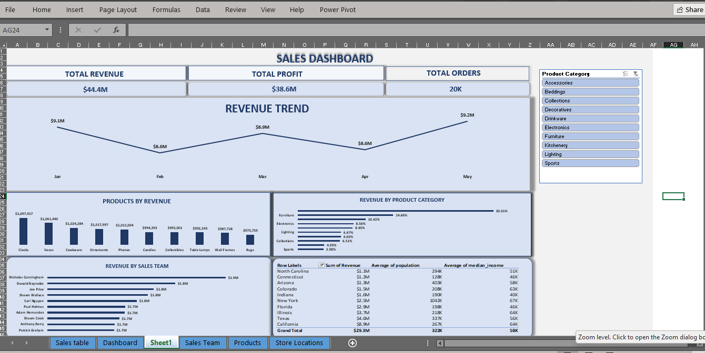
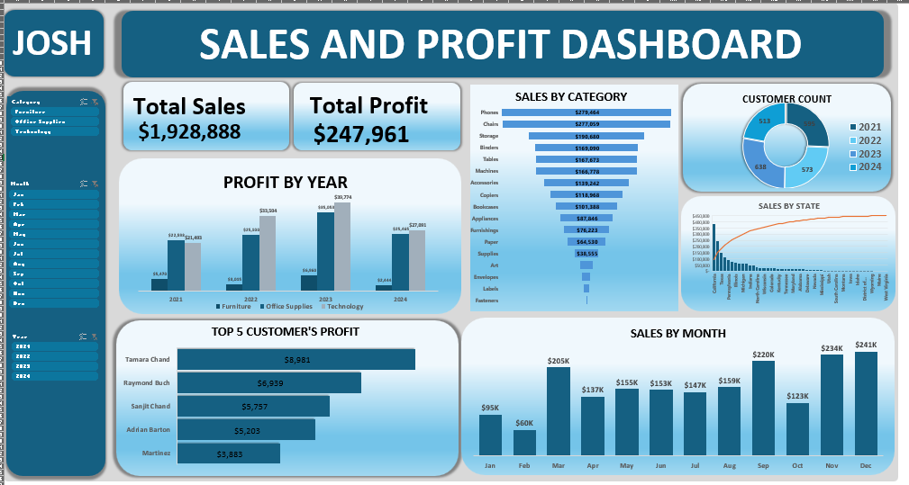

# Retail Sales & Profit Dashboards

Two interactive Excel dashboards built to analyze retail sales and profit 
performance across products, regions, sales teams, and time periods. Built 
end-to-end: raw data cleaning, relational data modeling, and interactive 
visualization design.

## Project 1: TNMT Retail Sales & Profit Dashboard

Analyzes 20,000 sales transactions across 45 states, 47 products, and 28 
sales representatives.

**What I did:**
- Cleaned and validated the raw dataset using Power Query, including 
  identifying a hidden date-formatting error affecting exactly half the 
  dataset (10,000 rows stored as raw serial numbers instead of dates), 
  which would have silently broken every time-based report if left 
  unnoticed
- Built a relational data model in Power Pivot connecting sales, product, 
  store, and sales-team tables via foreign key relationships
- Diagnosed and corrected an inactive/conflicting relationship that was 
  causing every sales rep to display an identical revenue total instead 
  of their actual individual performance
- Designed an interactive dashboard with revenue trend, product 
  performance, category contribution, and regional breakdown views, all 
  connected to a live Product Category slicer
- Delivered specific business insights, including top revenue products by 
  month, top-performing sales team by category, and the relationship 
  between state revenue, population, and median income

**Tools:** Excel, Power Query, Power Pivot, DAX (GETPIVOTDATA), PivotCharts

## Project 2: Sales & Profit Dashboard

Tracks total sales, profit, and order volume across product categories, 
sales channels, and time periods.

**What I did:**
- Built live-linked KPI cards (Total Sales, Total Profit, Total Orders) 
  using GETPIVOTDATA formulas so figures update in real time with slicer 
  selections
- Designed six coordinated visualizations, profit by year, sales by 
  category, sales by month, sales by state, customer count trends, and 
  top 5 customers by profit, under one consistent visual design system
- Enabled multi-dimensional filtering by Category, Month, and Year through 
  connected slicers across every report view

**Tools:** Excel, Power Pivot, PivotTables, PivotCharts

## Notes

Both workbooks are fully interactive when opened in Excel, download the 
`.xlsx` file and click any slicer to filter the dashboard live. GitHub's 
in-browser preview does not support interactive Excel features.
